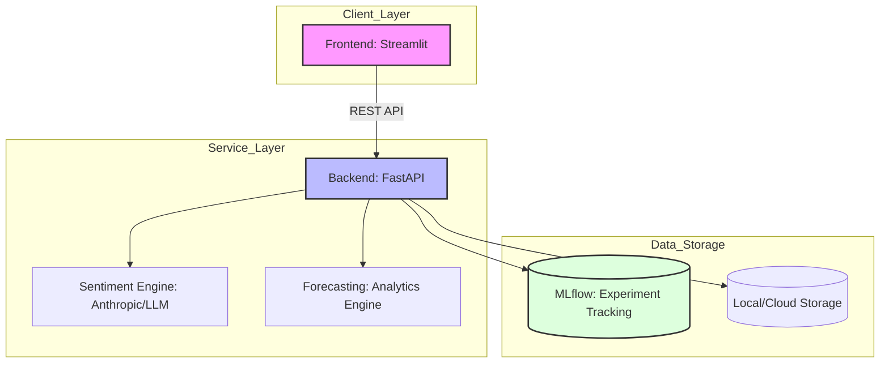

# Hotel Enterprise Analytics

A comprehensive enterprise-grade forecasting and analytics platform for hotel management.

## Quick Start

1. **Clone the repository** and navigate to the project directory:
   ```bash
   git clone <repository-url>
   cd hotel_enterprise
   ```

2. **Set up the virtual environment** and install dependencies:
   ```bash
   python -m venv venv
   source venv/bin/activate  # On Windows use `venv\Scripts\activate`
   pip install -r requirements.txt
   ```

3. **Configure Environment Variables**:
   ```bash
   cp .env.example .env
   # Open .env and add your HuggingFace/Anthropic API keys if needed
   ```

4. **Run the Backend (FastAPI)**:
   ```bash
   uvicorn backend.main:app --reload --port 8000
   ```

5. **Run the Frontend (Streamlit)**:
   ```bash
   streamlit run frontend/app.py
   ```

## Architecture Diagram



- **Frontend**: A sleek, user-friendly Streamlit dashboard providing interactive visualizations.
- **Backend**: A modular FastAPI service managing routing, API integration, and model orchestration.
- **MLflow**: Tracks experiments, model parameters, and training metrics automatically.

## Project Structure

```text
hotel_enterprise/
├── backend/            # FastAPI implementation & API routes
├── frontend/           # Streamlit UI components
├── src/                # Core logic: Sentiment & Forecasting engines
├── mlruns/             # MLflow local tracking (optional)
├── .gitignore          # Keeps the repo clean (excludes venv)
├── requirements.txt    # Project dependencies
└── .env.example        # Template for API keys
```

## Features

- **Robust NLP Engine**: 3-tier fallback architecture (HuggingFace -> Anthropic Claude -> TextBlob) with comprehensive error handling.
- **Experiment Tracking**: Full MLflow integration recording parameters, metrics, and models.
- **Clean API Design**: Modularized FastAPI endpoints returning consistent responses.
