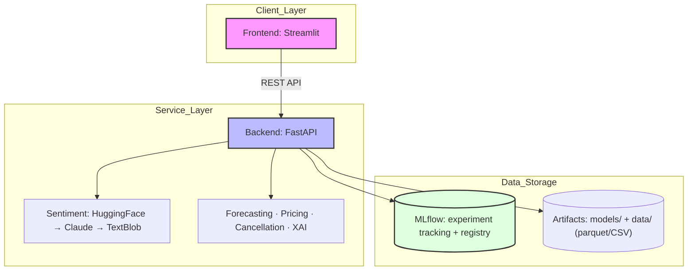

# Hotel Revenue ML Platform

**[🚀 Live Demo: Streamlit Dashboard](https://smart-hotel-analytics-platform-6ziv.onrender.com/)** | **[⚙️ API Documentation: FastAPI](https://smart-hotel-analytics-platform.onrender.com/docs)**

Forecasting and decision support for hotel revenue management cancellation
risk, occupancy/ADR forecasting, dynamic pricing, and overbooking served as a
FastAPI backend with a Streamlit front end.

## Why I built this

Revenue management is a surprisingly rich ML problem and a good one to learn the
unglamorous parts of the craft on. Cancellation prediction is a textbook
**leakage trap** the public dataset hands you features that quietly encode the
outcome, so a naive model scores beautifully and is worthless. Getting an
*honest* number means knowing which columns you could actually have at booking
time. On top of that, the prediction is only useful if the probability is
**calibrated** and the decision threshold reflects real costs (a walked guest vs.
an empty room), which is where most "0.9 AUC!" demos fall apart.

So the interesting work here isn't the model zoo it's the discipline around it:
removing leakage and defending the lower AUC, calibrating, forecasting demand
without leaking the future, and not over engineering the bits that don't need it
(the "LP overbooking optimiser" turned out to be a one-line argmax). The
decisions and the mistakes are written up in [`docs/decisions.md`](docs/decisions.md)
and [`docs/retrospective.md`](docs/retrospective.md) those are the most honest
part of this repo.

> ⚠️ **Mixed real + synthetic data — read this before trusting a metric.** The headline cancellation model trains on a **blend** of two sources: the **real [Antonio, Almeida & Nunes (2019) Hotel Booking Demand dataset](https://www.kaggle.com/datasets/jessemostipak/hotel-booking-demand)** (119,390 rows, ~67%, fetched by [`src/load_real_data.py`](src/load_real_data.py)) and **60,000 synthetic bookings** from [`src/generate_data.py`](src/generate_data.py). So the reported cancellation AUC is a genuine result on real bookings, not a simulation artifact, and the leakage remediation below is on real columns.
>
> The **forecasting series** (daily KPIs, external regressors), the guest **recommender's** interaction matrix (rule-based), and the **demo reviews** are fully synthetic, so those metrics measure how well the models fit a simulation rather than real-world performance. It's a portfolio/reference pipeline; to run the synthetic parts on real operations, swap the generated CSVs for PMS/POS exports of the same schema.

## Key Findings & Results

- **Cancellation Prediction**: Achieved an **honest Holdout AUC of 0.814** (Calibrated Brier Score: 0.163) using XGBoost on the real-majority blend (~67% Antonio et al., ~33% synthetic), evaluated on a single chronological hold-out (the most recent ~17% of rows).
- **Target Leakage Remediation**: The base Antonio Almeida Nunes dataset contains deterministic leakage (`booking_changes`, `days_in_waiting_list`, and `reservation_status`). These features were explicitly dropped to ensure realistic bounds on production performance.
- **Occupancy Forecasting**: Evaluated head to head, **Prophet** achieved an occupancy MAPE of ~15%, while a modern deep-learning **N-BEATS** baseline achieved ~15.9%.

*For detailed evaluation metrics, confusion matrices, and calibration diagrams, see [RESULTS.md](RESULTS.md) and the [Model Card](MODEL_CARD.md).*

## Quick Start

1. **Clone the repository**:
   ```bash
   git clone <repository-url>
   cd hotel_enterprise
   ```

2. **Set up the virtual environment** and install dependencies:
   ```bash
   python -m venv venv
   source venv/bin/activate
   pip install -r requirements.txt
   pip install -e .          # installs the backend/src packages (no sys.path hacks)
   ```

3. **Run the Backend (FastAPI)**:
   ```bash
   uvicorn backend.main:app --reload --port 8000
   ```

4. **Run the Frontend (Streamlit)**:
   ```bash
   streamlit run frontend/app.py
   ```

## Architecture Diagram


```mermaid
graph TD
    subgraph Client_Layer
        A["Frontend: Streamlit"]
    end

    subgraph Service_Layer
        A -->|REST API| B["Backend: FastAPI"]
        B --> C["Sentiment: HuggingFace → Claude → TextBlob"]
        B --> D["Forecasting · Pricing · Cancellation · XAI"]
    end

    subgraph Data_Storage
        B --> E[("MLflow: experiment tracking + registry")]
        B --> F[("Artifacts: models/ + data/ (parquet/CSV)")]
    end

    style A fill:#f9f,stroke:#333,stroke-width:2px
    style B fill:#bbf,stroke:#333,stroke-width:2px
    style E fill:#dfd,stroke:#333,stroke-width:2px
```

- **Frontend**: Streamlit dashboard providing interactive visualizations.
- **Backend**: FastAPI microservice managing routing, forecasting, cancellation risk, dynamic pricing, and overbooking optimization.
- **MLflow Tracking**: Tracks experiments, model parameters, and training metrics automatically.

## Configuration

All optional — the defaults run an open local demo. Set these to harden a deploy:

| Variable | Effect |
|----------|--------|
| `API_KEY` | Require an `X-API-Key` header on all `/api/v1/*` routes (`/health`, `/docs` stay public). |
| `CORS_ORIGINS` | Comma-separated allowed origins; defaults to `*`. |
| `ARTIFACTS_BUNDLE_URL` / `ARTIFACTS_BASE_URL` | Fetch models/data from an external store instead of the image see [`ARTIFACTS.md`](ARTIFACTS.md). |
| `MLFLOW_CANCELLATION_MODEL` | Serve the cancellation model from the MLflow registry instead of the local file. |
| `API_BASE` / `PUBLIC_API_URL` (frontend) | Where the dashboard calls / links to the API. |

## Validation & CI
The continuous integration suite actively enforces metric floors on the temporal holdout set:
- `holdout_auc > 0.80`
- `holdout_mape < 0.16`

The per-push CI runs lint + unit tests against the committed artifacts (fast);
full data generation and model training run on a separate manual job. See
[`.github/workflows/ci.yml`](.github/workflows/ci.yml).

## Project docs

- [`docs/decisions.md`](docs/decisions.md) — why things are built the way they are (ADR-style log).
- [`docs/retrospective.md`](docs/retrospective.md) — the bugs that taught me something (leakage, a dead threshold, OOM 502s).
- [`docs/roadmap.md`](docs/roadmap.md) — what's next and what's deliberately out of scope.
- [`ARTIFACTS.md`](ARTIFACTS.md) — how models/data are resolved at serve time and how to move them out of git/the image.
- [`REPRODUCIBILITY.md`](REPRODUCIBILITY.md) — seeds, repro steps, and known sources of non-determinism.
- [`MODEL_CARD.md`](MODEL_CARD.md) · [`RESULTS.md`](RESULTS.md) — model details and evaluation metrics.
