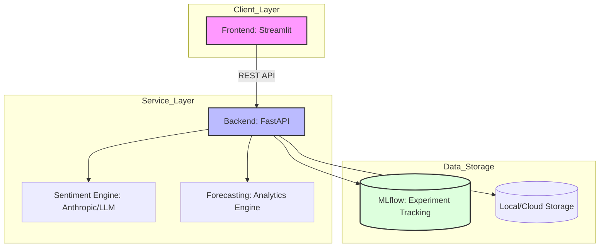

# Hotel Revenue ML Platform

**[🚀 Live Demo: Streamlit Dashboard](https://smart-hotel-analytics-platform-6ziv.onrender.com/)** | **[⚙️ API Documentation: FastAPI](https://smart-hotel-analytics-platform.onrender.com/docs)**

A comprehensive forecasting and analytics ML platform for hotel revenue management.

> ⚠️ **Synthetic data — demonstration project.** This platform trains and evaluates entirely on **synthetic data generated by [`src/generate_data.py`](src/generate_data.py)** (bookings, KPIs, reviews, regressors are all fabricated). The reported metrics measure how well the models fit a simulation, not real-world performance, and the guest "recommender" learns from a rule-based synthetic interaction matrix rather than real PMS data. It is a portfolio/reference pipeline, not a production system trained on real hotel operations. To run it for real, replace the generated CSVs with PMS/POS exports of the same schema.

## Key Findings & Results

- **Cancellation Prediction**: Achieved an **honest Holdout AUC of 0.814** (Calibrated Brier Score: 0.163) using XGBoost evaluated on a single chronological hold-out (the most recent ~17% of rows).
- **Target Leakage Remediation**: The base Antonio-Almeida-Nunes dataset contains deterministic leakage (`booking_changes`, `days_in_waiting_list`, and `reservation_status`). These features were explicitly dropped to ensure realistic bounds on production performance.
- **Occupancy Forecasting**: Evaluated head-to-head, **Prophet** achieved an occupancy MAPE of ~15%, while a modern deep-learning **N-BEATS** baseline achieved ~15.9%.

*For detailed evaluation metrics, confusion matrices, and calibration diagrams, see [RESULTS.md](RESULTS.md) and the [Model Card](MODEL_CARD.md).*

## Quick Start

1. **Clone the repository**:
   ```bash
   git clone <repository-url>
   cd hotel_enterprise
   ```

2. **Set up the virtual environment** and install dependencies:
   ```bash
   python -m venv venv
   source venv/bin/activate
   pip install -r requirements.txt
   pip install -e .          # installs the backend/src packages (no sys.path hacks)
   ```

3. **Run the Backend (FastAPI)**:
   ```bash
   uvicorn backend.main:app --reload --port 8000
   ```

4. **Run the Frontend (Streamlit)**:
   ```bash
   streamlit run frontend/app.py
   ```

## Architecture Diagram


```mermaid
graph TD
    subgraph Client_Layer
        A["Frontend: Streamlit"]
    end

    subgraph Service_Layer
        A -->|REST API| B["Backend: FastAPI"]
        B --> C["Sentiment Engine: Anthropic/LLM"]
        B --> D["Forecasting: Analytics Engine"]
    end

    subgraph Data_Storage
        B --> E[("MLflow: Experiment Tracking")]
        B --> F[("Local/Cloud Storage")]
    end

    style A fill:#f9f,stroke:#333,stroke-width:2px
    style B fill:#bbf,stroke:#333,stroke-width:2px
    style E fill:#dfd,stroke:#333,stroke-width:2px
```

- **Frontend**: Streamlit dashboard providing interactive visualizations.
- **Backend**: FastAPI microservice managing routing, forecasting, cancellation risk, dynamic pricing, and overbooking optimization.
- **MLflow Tracking**: Tracks experiments, model parameters, and training metrics automatically.

## Validation & CI
The continuous integration suite actively enforces metric floors on the temporal holdout set:
- `holdout_auc > 0.80`
- `holdout_mape < 0.16`
