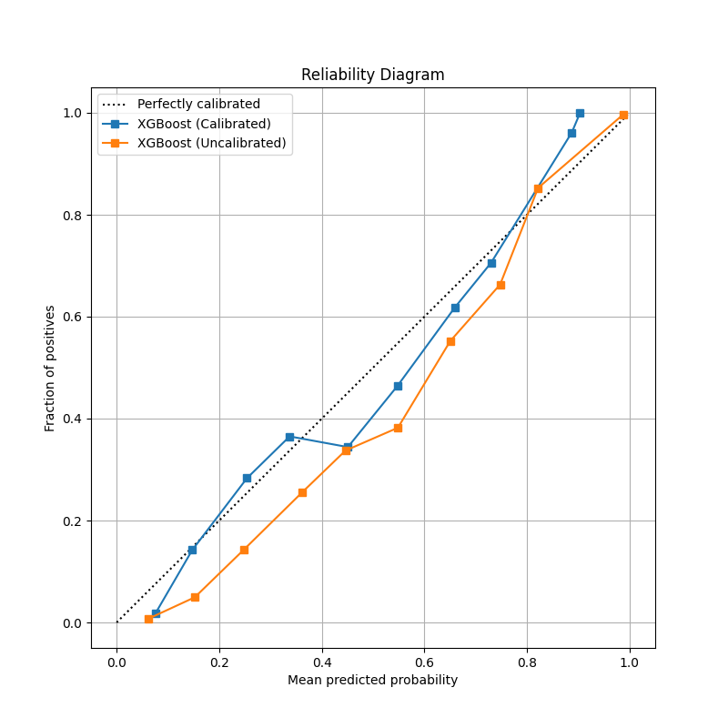

# Honest ML Pipeline Results
This document details the performance metrics after removing leakage columns and implementing a rigorous time-series walk-forward CV.

## 1. Classification Baselines
Models were trained using 5-fold TimeSeriesSplit and evaluated on the final temporal holdout.
| Model | AUC |
|---|---|
| LogisticRegression | 0.768 |
| XGBoost | 0.814 |
| LightGBM | 0.813 |

## 2. Calibration Analysis
The best performing model (**XGBoost**) was calibrated using CalibratedClassifierCV.
* **Calibrated AUC:** 0.809
* **Calibrated Brier Score:** 0.163
* **Calibrated F1:** 0.613



## 3. Subgroup Metrics
AUC & Brier scores evaluated on key segments within the temporal holdout.
### By Hotel
- **Resort Hotel:** AUC=0.799, Brier=0.160
- **City Hotel:** AUC=0.814, Brier=0.164
### By Top 5 Countries
- **PRT:** AUC=0.908, Brier=0.127
- **GBR:** AUC=0.817, Brier=0.155
- **FRA:** AUC=0.743, Brier=0.170
- **DEU:** AUC=0.798, Brier=0.142
- **ESP:** AUC=0.721, Brier=0.203
### By Season (Month)
- **May:** AUC=0.878, Brier=0.141
- **June:** AUC=0.851, Brier=0.150
- **July:** AUC=0.802, Brier=0.171
- **August:** AUC=0.782, Brier=0.173
- **September:** AUC=0.587, Brier=0.185
- **October:** AUC=0.590, Brier=0.192
- **November:** AUC=0.601, Brier=0.183
- **December:** AUC=0.550, Brier=0.182

## 4. Confusion Matrix (Holdout)
At the calibrated optimal threshold:
```text
[[15243  2054]
 [4402  5120]]
```

## 5. Forecasting Baselines
Comparing Prophet (with external regressors) against N-BEATS (univariate baseline).
| Target | Prophet MAPE | N-BEATS MAPE |
|---|---|---|
| occupancy | 15.05% | 15.95% |
| adr | 7.39% | N/A |
| revenue | 18.84% | N/A |